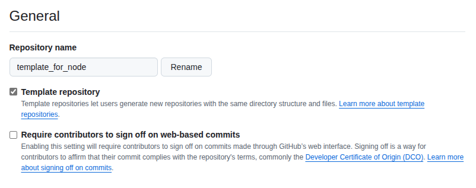
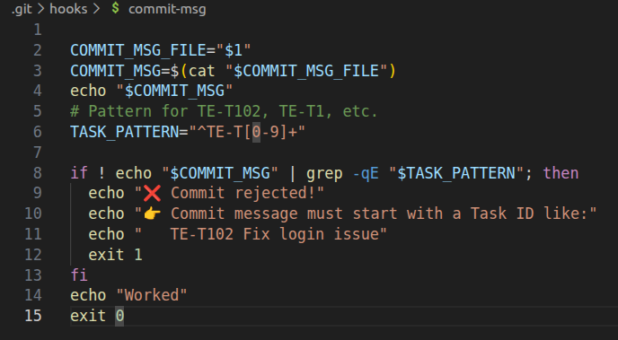
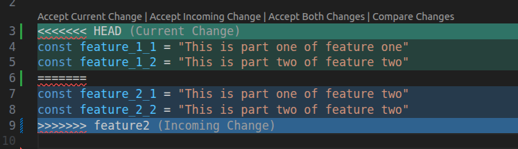

# Git Assessment Project

## Overview
This repository contains my Git assessment project.  
The goal of this project is to demonstrate my understanding of:
- Git basics (init, clone, status, add, commit, push etc.)
- Branching and merging (merge, rebase, squash, cherry-pick, conflicts etc.)
- Working with remote repositories (GitHub)

## Screenshot
Below is a screenshot representing the Flow of Repository:


## Exact steps performed (commands and meanings)

- Below are the commands I executed during the assessment and a short explanation for each.  
- Most of the Merge/Squash/Rebase were performed by raising a Pull Request, Revieing and Merging it. Just to show how it is done at command line I have written commands of them as well.

### 1) Create a Template Repository and Use it for assessment repository.


- Temlpate repositories are repositories which can be used as template or base for a project. I have created a nodejs template repository. 
- To use it, We have to mark (`Template Repository`) inside settings of repository.
- We will get an option to use it as template while creating other repositories.

### 2) Commit message hook enforcement

The local repository contains a commit-msg hook that enforces commit messages start with a task ID pattern (see `.git/hooks/commit-msg`). The pattern used is:

```
TASK_PATTERN="^TE-T[0-9]+"
```

- This hook checks the commit message and rejects commits whose first token does not match the `TE-T` task ID format (for example `TE-T102`). It helps maintain consistent commit messages across the repository.




### 3) Create feature branch TE-T102 from `develop` ,commit multiple times and rebase on develop.

```
git checkout -b TE-T102 develop
git commit -m "TE-T102 first commit"
# made multiple commits
```
- `git checkout -b TE-T102 develop`: create and switch to a new branch named `TE-T102` starting from the `develop` branch.
- `git commit -m "..."`: commit staged changes in the repository with the provided commit message.


```
git push origin TE-T102
# PR was created and branch was merged with rebase
```
- `git push origin <branch>`: It will push current branch to remote.   using Github UI.

OR

``` 
git rebase develop
```
- we could do it in command line using above command.
- `git rebase develop`: replay the commits of the current branch (`TE-T102`) on top of the latest `develop` branch commits.

### 4) Create TE-T103, Pull Latest Develop, Resolve Conflicts, and Squash-Merge into Develop

```
git checkout -b TE-T103 develop
# made multiple commits on TE-T103
git checkout develop
git pull origin develop
git checkout TE-T103
git rebase develop
# resolved any merge conflicts manually
git add .
git rebase --continue
# branch will be rebased if no further conflicts
```

- Example of conflict is shown in above image
```
git push origin TE-T103
```
- PR was created and merged with Squash.  
OR
```
git checkout develop
git merge TE-T103 --squash
git commit -m "TE-T103: squashed changes"
git push origin develop

```
- `git merge TE-T103 --squash`: take all changes from `TE-T103` and stage them as a single set of changes on the current branch (`develop`).

### 5) Cherry-pick a commit from TE-T201 into TE-T202

```
git checkout -b TE-T201 develop
git commit -m "TE-T201 readme chnaged"
git checkout -b TE-T202 develop
git cherry-pick <commit-hash-of-TE-T201-commit>
```
- `git cherry-pick <commit-hash>`: apply the changes introduced by the specified commit onto the current branch as a new commit..

### 6) Edit last commit message (amend) and remove an unwanted commit

```
git commit --amend -m "TE-T202: corrected message"
# made multiple commits
git reset --soft HEAD~1
```
- `git commit --amend -m "..."`: replace the most recent commit with a new commit message.
- `git reset --soft HEAD~1`: move `HEAD` back one commit.
- `--soft` will keep previous changes in staged area.
- `--mixed` will keep previous changes in unstaged area.
- `--hard` will update working directory to specified commit (Uncommited changes will be lost).

### 7) Merge `develop` into `main` and create a release tag

```
git checkout main
git merge develop -m "merged Release v1.0.0"
git tag -a v1.0.0 -m "Release v1.0.0"
git push origin v1.0.0
```
- `git merge develop`: merge `develop` into `main`.
- `git tag -a v1.0.0 -m "..."`: create an annotated tag named `v1.0.0` with a message (It automatically binds with previous commit if not specified).
- `git push origin v1.0.0`: pushed tag to the remote repository.

#### Differnt types of Tags:
- `Annotated Tags` : Created with additional metadata (author, date, message).Stored as full objects in Git database.
- `Lightweight Tags` : just a pointer to a commit. No metadata,no message etc.

### 8) Hotfix on `main` using branch TE-T301

```
git checkout -b TE-T301 main
# apply fix, commit (readme in this case)
git checkout main
git merge TE-T301 -m "TE-T301: updated README"
git push origin main
```
- `git checkout -b TE-T301 main`: create hotfix branch from `main`.
- `git merge TE-T301 -m "..."`: merge the hotfix branch to main with a message.


## Additional Learnings.

- `git reflog`:  It records every change to the repository, even if not present in commit history. we can use it to undo deleted commits or checkout to any old commits that are not present in current history.  
- `git stash`:    Stash takes a snapshot of working directory and saves it locally. It behaves like a stack, We can push and pop snapshots of working directory. Useful when we don't want to commit our changes yet and want to work on something else.
- `git revert`: It creates another commit, which does exact opposit of changes done in previous commit. Therefore end state will be same as previous commit. It is used to undo the current commit without deleteing the commit in history.


